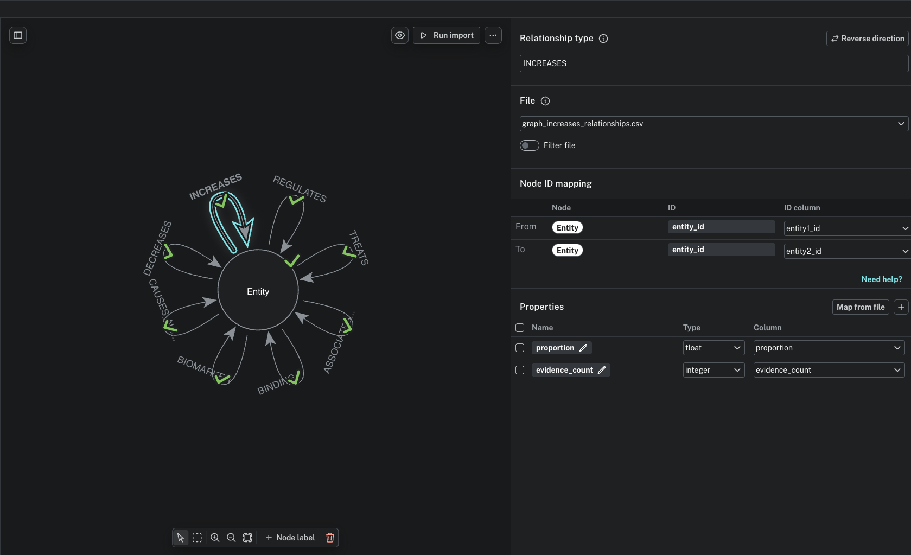

# biorelate_knowledge_graph
## Required Data:

For this build process you will need access to a Biorelate Galactic Data. This can be stored in a dbt compatible
database technology such as BigQuery, Redshift, Snowflake, etc.

The specific tables required from the Biorelate Galactic Data are defined in [the source schema for dbt](knowledge_graph/models/staging/galactic_data/_galactic_data__sources.yml).

## Building the Knowledge Graph
This repository contains code and ETL models to create a knowledge graph from Biorelate Galactic Data.

Under the `knowledge_graph/models` directory, you will find dbt models that define the structure of the knowledge graph, including tables and relationships. The `dbt_project.yml` file contains the configuration for the dbt project, specifying settings such as the project name, version, and profile to use, and other knowledge graph related configurations, e.g. what ontologies to include and a minimum amount of evidence.

The models follow the [dbt best practices layered architecture](https://docs.getdbt.com/best-practices/how-we-structure/1-guide-overview): staging views over raw sources, ephemeral intermediate models for business logic, and materialized mart tables as the final outputs. See be.lw flr for more details on the dbt models and their structure.

---

### dbt Project Structure

The `knowledge_graph/` dbt project follows the [dbt best practices layered architecture](https://docs.getdbt.com/best-practices/how-we-structure/1-guide-overview). When adding or modifying models, place them in the appropriate layer:

| Layer | Folder | Materialization | Purpose |
|---|---|---|---|
| Staging | `models/staging/` | View | Light-touch selection from raw sources; one model per source table |
| Intermediate | `models/intermediate/` | Ephemeral | Business logic transformations (filtering, unpivoting) |
| Marts | `models/marts/` | Table | Final knowledge graph outputs consumed by Neo4j |

#### Adding a new relationship type

1. No changes needed to staging.
2. Add the new relationship type as a CTE in [`models/intermediate/int_relationships_filtered.sql`](knowledge_graph/models/intermediate/int_relationships_filtered.sql) — follow the existing pattern of filtering the staging model by the relevant count column.
3. Add a new mart model in `models/marts/knowledge_graph/` named `graph_<relationship_type>_relationships.sql` using the existing macro:
   ```sql
   {{ select_relationship_by_type('<relationship_type>') }}
   ```

#### Adding a new source table

1. Register the table in [`models/staging/galactic_data/_galactic_data__sources.yml`](knowledge_graph/models/staging/galactic_data/_galactic_data__sources.yml).
2. Create a corresponding staging model in `models/staging/galactic_data/` named `stg_galactic_data__<table_name>.sql` that does a simple `select` from the source.
3. Reference the staging model (not the source directly) in any intermediate or mart models.

#### How the mart models work

Each `graph_<relationship_type>_relationships` mart is a one-liner that calls the `select_relationship_by_type` macro:

```sql
{{ select_relationship_by_type('<relationship_type>') }}
```

The macro ([`macros/select_relationships_by_type.sql`](knowledge_graph/macros/select_relationships_by_type.sql)) selects from `int_relationships_filtered` and filters to the given type. This keeps the mart models DRY — all filtering and unpivoting logic lives in the intermediate model, and the macro handles the per-type subselect.

#### Naming conventions

- Staging: `stg_<source>__<entity>s.sql`
- Intermediate: `int_<entities>_<verb>s.sql`
- Marts: descriptive plain-English names, e.g. `graph_nodes.sql`, `graph_<type>_relationships.sql`

### Building the Knowledge Graph with dbt

To build the knowledge graph from the dbt project, first change directory into the dbt project folder
`knowledge_graph`

```bash
cd knowledge_graph
```

Create a profiles yml file in the `knowledge_graph` directory to define your warehouse according to
dbt best practices for chosen tech stack: https://docs.getdbt.com/docs/core/connect-data-platform/profiles.yml. An example profiles.yml for BigQuery is shown below:

```yaml
knowledge_graph:
  outputs:
    dev: # Name of the target
      dataset: <knowledge_graph_dataset> # Name of the dataset in BigQuery to use
      job_execution_timeout_seconds: 300
      job_retries: 1
      location: us-central1 # GCP location
      method: oauth
      priority: interactive
      project: <your_gcp_project_id> # GCP Project ID
      threads: 1
      type: bigquery # Data warehouse type
  target: dev
```

and then run the following command to build the knowledge graph models:

```bash
dbt build --select knowledge_graph
```

If you want to store the profiles yml file in a different location, you can update the bash build
command to specify the location of the profiles yml file, e.g.

```bash
dbt build --select knowledge_graph --profiles-dir <path_to_profiles_yml_directory>
```

In this example ETL process, we parametrize the source data for the knowledge graph using
environment variables. The following environment variables can be set to customize the knowledge graph build:
- `DBT_SOURCE_DATABASE`: This is in BigQuery (confusingly) the GCP project ID containing the Biorelate Galactic data to use as source data for the knowledge graph. This may differ depending on the database technology you are using, e.g. redshift, athena etc.
- `DBT_SOURCE_SCHEMA`: The schema (in BigQuery is the dataset) containing the Biorelate Galactic data to use as source data for the knowledge graph.

The naming convention above is to be conformant with dbt best practices. You can set these environment variables in your terminal session before running the dbt build command, e.g.

```bash
export DBT_SOURCE_DATABASE=<your_gcp_project_id>
export DBT_SOURCE_SCHEMA=<biorelate_galactic_dataset>

dbt build --select knowledge_graph
```

Once the build is complete, the knowledge graph tables will be created in the specified database dataset. You can then query these tables to explore the knowledge graph data.

#### Parameterizing the Knowledge Graph Build

The knowledge graph build process can be customized using several configuration variables defined in the `dbt_project.yml` file. These variables allow you to control various aspects of the knowledge graph generation, such as which ontologies to include, the minimum evidence required for relationships, and other settings.

Please see the `vars` section of the `dbt_project.yml` file for a list of available configuration variables and their default values. You can override these defaults by specifying your own values in the `dbt_project.yml` file or by passing them as command-line arguments when running dbt commands.

If you wish to extend the configurations further, you can modify the dbt models to include additional parameters or logic as needed for your specific use case.

### Output Tables

The dbt build produces the following tables in your data warehouse:

- `graph_nodes`: nodes of the knowledge graph with `entity_id` and `entity_name`.
- `graph_<relationship_type>_relationships`: one table per relationship type (e.g. `graph_increases_relationships`), each containing `entity1_id`, `entity2_id`, `proportion`, and `evidence_count`.


### General Guidance:
- We would generally advise starting small and building up with more data and complexity as you go, the fewer nodes and edges there are in the graph the easier it will be to establish the ETL to Neo4j.
- We have included parameterization in the dbt models for minimum evidence thresholds, this can be used to filter out low evidence relationships which may add noise to the graph either from NLP extraction or from the underlying data (e.g. a relationship mentioned in one paper once in 1890). Starting with a higher evidence threshold can help to create a more manageable graph to work with in the early stages of development. As you work more with the graph, and especially if there is a focus on novel / less well established concepts the evidence threshold can be reduced to include more relationships.
- We have also included an ontology filter in the dbt models which can limit the graph to certain concepts, this can also help to create a more manageable graph in the early stages, e.g. you could limit the graph to only include relationships between genes, chemicals, diseases etc.
- All relationship types are included in the output tables, but it can be worth considering pruning down the types. E.g. frequently the subset of "increases", "decreases", "regulates", "binding", "biomarker" and "treats" is a good starting point.

## Neo4j Export

Once the knowledge graph is built you can export the required tables to CSV using your warehouse's export functionality.
export functionality. These CSV files can then be imported into Neo4j using the Neo4j Data Importer tool or Cypher scripts.

The files need to import the graph into Neo4j should include:
- `graph_nodes.csv`: This file should contain the nodes of the graph, with columns for `entity_id`, `entity_name`, and any other relevant node properties.
- `graph_<relationship_type>_relationships.csv`: These files should contain the relationships between nodes for each relationship type, with columns for `start_entity_id`, `end_entity_id`, and any other relevant relationship properties (e.g. evidence count, proportion).

### Neo4j Import

An example import model for Neo4j is included [in this JSON file](docs/neo4j_import_model.json) which defines the example schema for the knowledge graph in Neo4j and can be used as a template for importing the CSV files into Neo4j. In the importer pane of the Neo4j UI you can select `open model` and upload the JSON file.
You can connect either local files, or files stored in a cloud storage bucket (e.g. GCS, S3 etc.) to the Neo4j Data Importer tool depending on your setup and preferences.

A screenshot of the Neo4j Data Importer tool is shown below:


:warning: You may need to adjust the import model and/or the CSV files depending on the specific structure of your knowledge graph and the requirements of your Neo4j instance. For example, you may want to include additional properties for nodes and relationships. You can refer to the Neo4j import documentation for more details also: https://neo4j.com/docs/data-importer/current/

### Model Context Protocol (MCP)

To connect to Claude Desktop we can update the our claude desktop configuration file, e.g.

```json
{
  "mcpServers": {
    "neo4j-galactic-graph": {
      "command": "<UVX_PATH>/uvx",
      "args": [
        "mcp-neo4j-cypher@0.5.3",
        "--transport",
        "stdio"
      ],
      "env": {
        "NEO4J_URI": "<NEO4J_URI>",
        "NEO4J_USERNAME": "neo4j",
        "NEO4J_PASSWORD": "<NEO4J_PASSWORD>",
        "NEO4J_DATABASE": "neo4j",
        "NEO4J_READ_ONLY": "true"
      }
    }
  }
}
```

Once these settings have been updated you can start Claude Desktop and connect to the Neo4j knowledge graph instance.
This example uses the `mcp-neo4j-cypher` MCP to connect to a Neo4j instance containing the knowledge graph, which is installed via [uvx](https://docs.astral.sh/uv/guides/tools/)

:warning: Make sure to check the latest version of the `mcp-neo4j-cypher` MCP as there may have been updates since the time of writing.

Other options include:
- Using [MCP toolbox for Databases](https://github.com/googleapis/genai-toolbox) to connect to
the neo4j database. This option allows for defining more advanced MCP tools (e.g. defining specific queries).
- Creating a custom MCP server that connects to the Neo4j database and exposes specific functionality. This can be achieved with something like [FastMCP](https://gofastmcp.com/getting-started/welcome).

